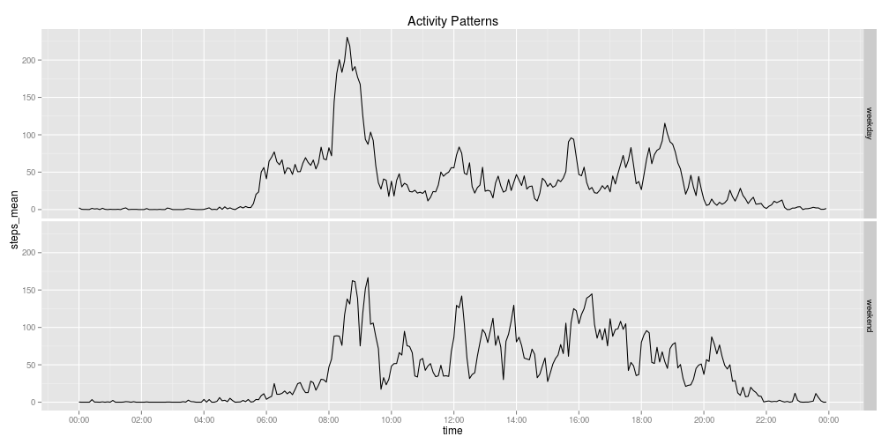

Assignment 1
========================================================

## Loading and preprocessing the data

### Load libraries and data


```r
require(data.table)
require(ggplot2)
require(gridExtra)
require(scales)
activity = data.table(read.csv("activity.csv"))
Sys.setlocale(locale="en_US.UTF-8")
```

### The data.table 'activity'


```r
activity
```

```
##        steps       date interval
##     1:    NA 2012-10-01        0
##     2:    NA 2012-10-01        5
##     3:    NA 2012-10-01       10
##     4:    NA 2012-10-01       15
##     5:    NA 2012-10-01       20
##    ---                          
## 17564:    NA 2012-11-30     2335
## 17565:    NA 2012-11-30     2340
## 17566:    NA 2012-11-30     2345
## 17567:    NA 2012-11-30     2350
## 17568:    NA 2012-11-30     2355
```

## What is mean total number of steps taken per day?

### Histogram of the total number of steps taken each day


```r
steps.summary = activity[, list(steps.per.day=sum(steps, na.rm=T)), by=date]
ggplot(aes(x = steps.per.day), data = steps.summary) +
    geom_histogram(binwidth=2500)
```

 

### Calculate the mean and median total number of steps taken per day


```r
activity[, sum(steps, na.rm=T), by=date][,list(mean=mean(V1), median=median(V1))]
```

```
##    mean median
## 1: 9354  10395
```

## What is the average daily activity pattern?


```r
average.day = activity[, list(steps_mean=mean(steps, na.rm=T)), by=interval]
average.day$time = seq(c(ISOdate(2000,3,20,23,0,0)), by = "5 min", length.out = 288)

ggplot(data=average.day, aes(x=time, y=steps_mean)) +
    geom_line() +
    scale_x_datetime(breaks="2 hours",
                     labels = date_format("%H:%M"))
```

 

### Average maximum steps time interval


```r
average.day$time = format(seq(c(ISOdate(2000,3,20,23,0,0)), by = "5 min", length.out = 288), "%H:%M")
average.day[order(-steps_mean)][1]
```

```
##    interval steps_mean  time
## 1:      835      206.2 08:35
```

## Imputing missing values

### Sum NA's


```r
sum(is.na(activity))
```

```
## [1] 2304
```

### Impute the mean for that 5-minute interval


```r
activity.imputed = activity
activity.imputed = merge(activity.imputed, average.day, by=c('interval'))
activity.imputed[is.na(steps)]$steps = as.integer(round(activity.imputed[is.na(steps)]$steps_mean))
activity.imputed
```

```
##        interval steps       date steps_mean  time
##     1:        0     2 2012-10-01      1.717 00:00
##     2:        0     0 2012-10-02      1.717 00:00
##     3:        0     0 2012-10-03      1.717 00:00
##     4:        0    47 2012-10-04      1.717 00:00
##     5:        0     0 2012-10-05      1.717 00:00
##    ---                                           
## 17564:     2355     0 2012-11-26      1.075 23:55
## 17565:     2355     0 2012-11-27      1.075 23:55
## 17566:     2355     0 2012-11-28      1.075 23:55
## 17567:     2355     0 2012-11-29      1.075 23:55
## 17568:     2355     1 2012-11-30      1.075 23:55
```

### Histogram of the total number of steps taken each day - imputed dataset


```r
steps.summary = activity.imputed[, list(steps.per.day=sum(steps, na.rm=T)), by=date]
ggplot(aes(x = steps.per.day), data = steps.summary) +
    geom_histogram(binwidth=2500)
```

 

### Calculate the mean and median total number of steps taken per day - imputed dataset


```r
activity.imputed[, sum(steps, na.rm=T), by=date][,list(mean=mean(V1), median=median(V1))]
```

```
##     mean median
## 1: 10766  10762
```

## Differences in activity patterns between weekdays and weekends


```r
activity.imputed$weekDay = weekdays(as.Date(activity.imputed$date))
setkey(activity.imputed, weekDay)

# prepare weekend dataset
weekendActivity = activity.imputed[J(c('Saturday','Sunday')),
                                   list(steps_mean= mean(steps)), by=interval]
weekendActivity$time = seq(c(ISOdate(2000,3,20,23,0,0)), by = "5 min", length.out = 288)

# prepare weekend plot
plot1 = ggplot(data=weekendActivity, aes(x=time, y=steps_mean)) +
    geom_line() + ggtitle("Weekend") +
    scale_x_datetime(breaks="2 hours",
                     labels = date_format("%H:%M"))

# prepare week dataset
weekActivity = activity.imputed[J(c('Monday','Tuesday','Wednesday','Thursday','Friday')),
                                list(steps_mean= mean(steps)), by=interval]
weekActivity$time = seq(c(ISOdate(2000,3,20,23,0,0)), by = "5 min", length.out = 288)

# prepare week plot
plot2 = ggplot(data=weekActivity, aes(x=time, y=steps_mean)) +
    geom_line() + ggtitle("Weekday") +
    scale_x_datetime(breaks="2 hours",
                     labels = date_format("%H:%M"))
grid.arrange(plot1, plot2, nrow=2)
```

 
